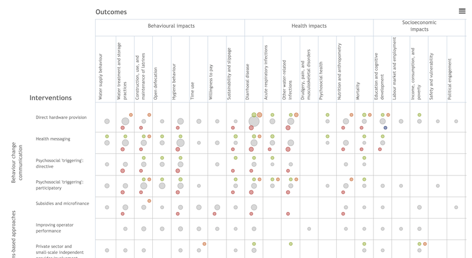

```{r setup, include=FALSE}
library(learnr)
knitr::opts_chunk$set(echo = FALSE)
```

## Overview


Systematic reviews and meta-analyses are great resources for discovering the best scientific evidence about the impact of an intervention on specific clinical, behavioral, or social outcomes. Finding a good review can save you hours of searching and will give you a ready-made search strategy to update or modify.

### Learning Objectives

* Understand how to read and critique a systematic review 
* Interpret a meta-analysis and forest plot

## Before class

### Prepare

* Read [GHR Chapter 3](https://read.themethodsection.com/filtered.html){target="_blank"}.
* Search the [Cochrane Library](http://www.cochranelibrary.com/), [Campbell Collaboration](http://www.campbellcollaboration.org/), [3ie](http://www.3ieimpact.org/evidence/systematic-reviews/), or [Pubmed Clinical Queries](http://www.ncbi.nlm.nih.gov/pubmed/clinical/) to find a systematic review related to your interests. Select a review that includes a meta-analysis. Download or print and bring to class. Be prepared to share a brief summary of the research question and findings.

<!--
<iframe height="800" width="100%" src="https://duke.qualtrics.com/jfe/form/SV_bBg1PTRLi5Usjat" frameborder="0"></iframe>
-->

### Pre-Class Assessment

```{r pca01-4, echo=FALSE}
quiz(
question("Which of the following is incorrect regarding meta-analysis?.",
  answer("It estimates the pooled effect size of multiple publications systematically", message = "This is correct, meta-analysis is a technique for combining the results of multiple studies to estimate a pooled effect size."),
  answer("Can be either quantitative or qualitative", correct = TRUE),
  answer("The results are weighted for differences in the quality and size of the studies", message = "This is correct, meta-analysis takes variations in study size and quality into consideration."),
  allow_retry = TRUE
  ),
question("Results in a meta-analysis are typically summarized in a ______ .",
  answer("Forest plot", correct = TRUE),
  answer("Stemplots", message = "Stemplots help visualize all the individual elements of a data set."),
  answer("Boxplot", message = "Boxplots are useful in showing the five-number summary i.e. the minimum, lower quartile, median, upper quartile and the maximum."),
  allow_retry = TRUE
  ),
question("This is question 3.",
  answer("a", correct = TRUE),
  answer("b", message = "Custom message here."),
  answer("c", message = "Custom message here."),
  allow_retry = TRUE
  ),
question("The measure of the strength or magnitude of a relationship between two variables on a numerical scale is called ______ .",
  answer("Heterogeneity", message = "Heterogeneity in a forest plot refers to the diversity in effect size estimates across studies."),
  answer("Confidence interval", message = "A confidence interval gives an estimated range of values which is likely to include an unknown population parameter, the estimated range being calculated from a given set of sample data."),
  answer("Effect size", correct = TRUE),
  allow_retry = TRUE
  ),
question("A good place to first check if a systematic review research question is registered would be _______ .",
  answer("Prospero", correct = TRUE),
  answer("Cochrane Library", message = "Cochrane is a great source for finding systematic reviews and meta-analysis in global health."),
  answer("3ie", message = "3ie is a great source for finding systematic reviews and meta-analysis in global health."),
  allow_retry = TRUE
  )
)
```


## During class

### Mini Lecture


[Deck](https://docs.google.com/presentation/d/e/2PACX-1vRxRnNU7nsleGimCrSdfDR1Wv9Qy_WNDZPgjSREQVZiGRg1PnG7QBJG-25jxLHUptaBXZV-MtczfOaA/pub?start=false&loop=false&delayms=15000){target="_blank"} / [Downloadable full resolution screencast](https://www.dropbox.com/s/xlfnhhjqwm871tg/GHR%20CH03.mov?dl=0)

### Activity

In this activity you will work with a partner to explore a systematic review on a topic of mutual interest that includes a meta-analysis. The main objectives are to gain a better understanding of how systematic reviews are reported and to practice interpreting a forest plot.

<iframe src="https://drive.google.com/file/d/1LmJzoldNOSuTelAbmIpVm0nFwY7gaerq/preview" width="100%" height="480"></iframe>

[Download activity sheets](https://drive.google.com/open?id=1VKNGv6buP9iGLPEbrbdYsw1YtcKGNkdE)

## After class



An optional activity is to explore the [evidence gap maps](https://www.3ieimpact.org/evidence-hub/evidence-gap-maps) produced by 3ie. This video shows you how to use gap maps. See also [this pdf](https://www.3ieimpact.org/sites/default/files/2019-02/how-to-read-egm-document-top.pdf).


