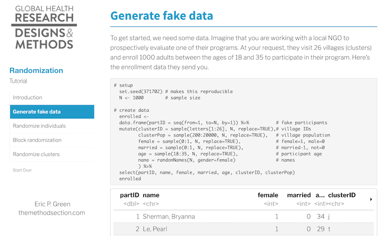

```{r setup, include=FALSE}
library(learnr)
knitr::opts_chunk$set(echo = FALSE)
```

## Overview


### Learning Objectives

* Articulate the benefits and limitations of random assignment
* Describe the basic design options of randomized experiments
* Understand common sources of bias/threats to internal validity

## Before class

### Prepare

* Chapter 2 "Why Randomize?" in Glennerster, R. & Takavarasha, K. (2013). [*Running Randomized Evaluations: A Practical Guide*](https://amzn.to/30cmbdE){target="_blank"} (P)
* Review [CONSORT statement and guidelines](http://www.equator-network.org/reporting-guidelines/consort/){target="_blank"}

<div style="max-width:854px"><div style="position:relative;height:0;padding-bottom:56.25%"><iframe src="https://embed.ted.com/talks/lang/en/esther_duflo_social_experiments_to_fight_poverty" width="854" height="480" style="position:absolute;left:0;top:0;width:100%;height:100%" frameborder="0" scrolling="no" allowfullscreen></iframe></div></div>

<br>

Read the Introduction and Method sections of the following articles:

* **Phase 1, Individuals Randomized:** Li, J. X., Hou, L. H., Meng, F. Y., Wu, S. P., Hu, Y. M., Liang, Q., … & Wang, W. J. (2017). Immunity duration of a recombinant adenovirus type-5 vector-based Ebola vaccine and a homologous prime-boost immunisation in healthy adults in China: final report of a randomised, double-blind, placebo-controlled, phase 1 trial. [*The Lancet Global Health, 5(3)*](https://www.ncbi.nlm.nih.gov/pubmed/28017642){target="_blank"}, e324-e334.
* **Phase 3, Clusters Randomized:** Henao-Restrepo, A. M., Camacho, A., Longini, I. M., Watson, C. H., Edmunds, W. J., Egger, M., … & Draguez, B. (2017). Efficacy and effectiveness of an rVSV-vectored vaccine in preventing Ebola virus disease: final results from the Guinea ring vaccination, open-label, cluster-randomised trial (Ebola Ça Suffit!). [*The Lancet, 389(10068)*](https://www.ncbi.nlm.nih.gov/pmc/articles/PMC5364328/){target="_blank"}, 505-518.
* **Stepped-Wedge:** Gambia Hepatitis Study Group. (1987). The Gambia hepatitis intervention study. [*Cancer Research, 47(21)*](https://www.ncbi.nlm.nih.gov/pubmed/2822233){target="_blank"}, 5782-5787.
* **Equivalence:** Mir, F., Nisar, I., Tikmani, S. S., Baloch, B., Shakoor, S., Jehan, F., … & Zaidi, A. K. (2017). Simplified antibiotic regimens for treatment of clinical severe infection in the outpatient setting when referral is not possible for young infants in Pakistan (Simplified Antibiotic Therapy Trial [SATT]): a randomised, open-label, equivalence trial. [*The Lancet Global Health, 5(2)*](https://www.ncbi.nlm.nih.gov/pmc/articles/PMC5250591/){target="_blank"}, e177-e185.
* **Non-inferiority, Study Protocol:** Hanlon, C., Alem, A., Medhin, G., Shibre, T., Ejigu, D. A., Negussie, H., … & Lund, C. (2016). Task sharing for the care of severe mental disorders in a low-income country (TaSCS): study protocol for a randomised, controlled, non-inferiority trial. [*Trials, 17(1)*](https://www.ncbi.nlm.nih.gov/pmc/articles/PMC4750210/){target="_blank"}, 76.
* **Randomized Encouragement:** Devoto, F., Duflo, E., Dupas, P., Parienté, W., & Pons, V. (2012). Happiness on tap: piped water adoption in urban Morocco. [*American Economic Journal: Economic Policy, 4(4)*](https://www.aeaweb.org/articles?id=10.1257/pol.4.4.68){target="_blank"}, 68-99.


## During class

[Deck](https://docs.google.com/presentation/d/e/2PACX-1vTbRS9t2fQZfO1eWnGplqABS5xG74bEqjp9cfpOfbiBGSRN7HqtFdl1UjB_w824grbBfB7goXZNmXsq/pub?start=false&loop=false&delayms=15000){target="_blank"}

### Activity

<iframe src="https://drive.google.com/file/d/1sBFQKpvfAz2h0rvWPSoUzqJo8ZMaAbxr/preview" width="100%" height="480"></iframe>

[Download activity sheets](https://drive.google.com/open?id=1VKNGv6buP9iGLPEbrbdYsw1YtcKGNkdE)

## After class

As a new research assistant you might be asked to randomly assign a list of enrolled study participants to study arms. Yikes! What do you do?

If you are working on a drug trial, the best answer is probably run. You should not be doing the randomization. But for lots of open label trials of interventions and experiments like the ones you will find in [JPAL's database](https://www.povertyactionlab.org/){target="_blank"}, RAs are often involved in the randomization process. An optional after-class activity is to learn how to randomize with R.

### Tutorial



Click [here](https://learn.themethodsection.com/tutorial/randomize/){target="_blank"} for a tutorial that will show you how to use the [`randomizer`](https://declaredesign.org/r/randomizr/){target="_blank"} and [`blockTools`](http://www.ryantmoore.org/html/software.blockTools.html){target="_blank"} packages for R to randomly assign units like people and villages to study arms.


### To learn more

Want to learn more about how to run a trial? Sign up for the MIT MOOC by Rachel Glennerster and Anja Sautmann called [*Designing and Running Randomized Evaluations*](https://www.edx.org/course/designing-and-running-randomized-evaluations-5){target="_blank"}. Another great option by the same duo is [*Evaluating Social Programs*](https://www.edx.org/course/evaluating-social-programs-2){target="_blank"}.


