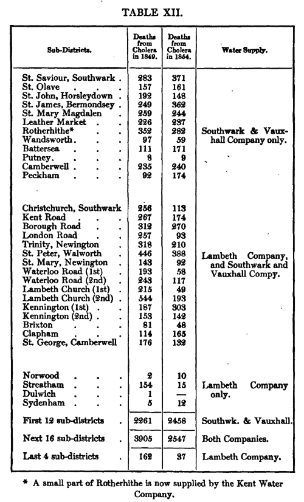

```{r setup, include=FALSE}
library(learnr)
knitr::opts_chunk$set(echo = FALSE)
```

## Overview


### Learning Objectives

* Explain the logic and limitations of different quasi-experimental designs that can be used when randomization is not possible or ethical

## Before class

### Prepare

* Review [TREND statement and guidelines](https://www.cdc.gov/trendstatement/){target="_blank"}
* Read the Introduction and Method sections of the following articles:
  * **Pre-Post:** Cluver, L., Meinck, F., Yakubovich, A., Doubt, J., Redfern, A., Ward, C., … & Romero, R. H. (2016). Reducing child abuse amongst adolescents in low-and middle-income countries: a pre-post trial in South Africa. [*BMC Public Health, 16(1)*](https://www.ncbi.nlm.nih.gov/pmc/articles/PMC5137206/){target="_blank"}, 567.
  * **Post-Test Only:** Mitchell, S., Gelman, A., Ross, R., Chen, J., Bari, S., Huynh, U. K., ... & Makela, S. (2018). The Millennium Villages Project: a retrospective, observational, endline evaluation. [*The Lancet Global Health, 6(5)*](https://www.thelancet.com/journals/langlo/article/PIIS2214-109X(18)30065-2/fulltext){target="_blank"}, e500-e513.
  * **Difference-in-Differences:** McKinnon, B., Harper, S., Kaufman, J. S., & Bergevin, Y. (2015). Removing user fees for facility-based delivery services: a difference-in-differences evaluation from ten sub-Saharan African countries. [*Health Policy and Planning, 30(4)*](https://www.ncbi.nlm.nih.gov/pmc/articles/PMC4385820/){target="_blank"}, 432-441.
  * **Interrupted Time Series:** Rashidian, A., Joudaki, H., Khodayari-Moez, E., Omranikhoo, H., Geraili, B., & Arab, M. (2013). The impact of rural health system reform on hospitalization rates in the Islamic Republic of Iran: an interrupted time series. [*Bulletin of the World Health Organization, 91(12)*](https://www.ncbi.nlm.nih.gov/pmc/articles/PMC3845261/){target="_blank"}, 942-949.
  * **Regression Discontinuity**: Smith, L. M., Kaufman, J. S., Strumpf, E. C., & Lévesque, L. E. (2015). Effect of human papillomavirus (HPV) vaccination on clinical indicators of sexual behaviour among adolescent girls: The Ontario Grade 8 HPV Vaccine Cohort Study. [*Canadian Medical Association Journal, 187(2)*](https://www.ncbi.nlm.nih.gov/pmc/articles/PMC4312170/){target="_blank"}, E74-E81.

## During class

[Deck](https://docs.google.com/presentation/d/e/2PACX-1vSovq2OiEOJiEEU1ZWdoFG6DrV6Q10HUXuq7ZljwNNrXXRcedx1giUS6hWuYcO4aC0tx3e8yHhYXji4/pub?start=false&loop=false&delayms=15000){target="_blank"}

### Activity

In this activity you will examine several examples of quasi-experimental approaches in the published literature and complete an exercise in which you will generate various quasi-experimental estimates of causal effect and evaluate how they change as the evaluation strategy becomes more rigorous.

#### The quasi-experimentalist John Snow

*This activity was designed by [Amy Finnegan](https://sites.google.com/site/amyfinnegan/home){target="_blank"} (with credit due to [Mastering Metrics](https://www.amazon.com/dp/B00MZG71MC/ref=dp-kindle-redirect?_encoding=UTF8&btkr=1){target="_blank"}). I probably made it less cool with my edits over time.*

Difference-in-difference analysis is one of the oldest tricks in the book. In the mid-1800s, John Snow used this method to discover how residents of London were being infected with cholera.

Snow observed that the Southwark and Vauxhall Company and the Lambeth Company supplied water to high-death-rate districts in South London. Both companies used the Thames—which was highly contaminated—as their water source before 1852. In 1852, the Lambeth Company began to source water from the Thames Ditton river—which was upstream and uncontaminated. Snow was able to show that between 1849 and 1854, districts that remained supplied by the Southwark and Vauxhall Company saw an increase in deaths from cholera while those supplied by the Lambeth Company experienced a reduction in deaths from cholera.

Use [this table](http://www.ph.ucla.edu/epi/snow/table12a.html){target="_blank"} taken from Snow’s original 1855 article to reproduce Snow’s difference-in-difference estimates.



<iframe src="https://drive.google.com/file/d/1thpRYlQnpBGvl6wy-P38Y65NwfMCnjyC/preview" width="100%" height="480"></iframe>

[Download activity sheets](https://drive.google.com/open?id=1VKNGv6buP9iGLPEbrbdYsw1YtcKGNkdE)

## After class

Interrupted time series is a great method to know if you plan to work in policy analysis or have access to routinely collected data. Check out [this course on ITS and regression discontinuity](https://www.edx.org/course/policy-analysis-using-interrupted-time-ubcx-itsx-2){target="_blank"} by Michael Law.


